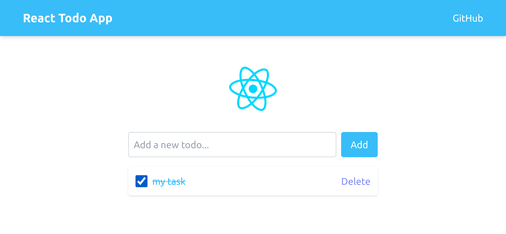

<a id="readme-top"></a>

<!-- PROJECT SHIELDS -->
[![Contributors][contributors-shield]][contributors-url]
[![Forks][forks-shield]][forks-url]
[![Stargazers][stars-shield]][stars-url]
[![Issues][issues-shield]][issues-url]
[![License][license-shield]][license-url]
[![LinkedIn][linkedin-shield]][linkedin-url]

<!-- PROJECT LOGO -->
<br />
<div align="center">
  <a href="https://github.com/jeferson0993/react-todo-app">
    
  </a>

  <h3 align="center">React todo</h3>

  <p align="center">
    A simple Todo List PWA project made with React
    <br />
    <a href="https://github.com/jeferson0993/react-todo-app"><strong>Explore the docs »</strong></a>
    <br />
    <br />
    <a href="https://react-todo-pwa-app.web.app/">View Demo</a>
    ·
    <a href="https://github.com/jeferson0993/react-todo-app/issues/new?labels=bug&template=bug-report---.md">Report Bug</a>
    ·
    <a href="https://github.com/jeferson0993/react-todo-app/issues/new?labels=enhancement&template=feature-request---.md">Request Feature</a>
  </p>
</div>


<!-- TABLE OF CONTENTS -->
<details>
  <summary>Table of Contents</summary>
  <ol>
    <li>
      <a href="#about-the-project">About The Project</a>
      <ul>
        <li><a href="#built-with">Built With</a></li>
      </ul>
    </li>
    <li>
      <a href="#getting-started">Getting Started</a>
      <ul>
        <li><a href="#prerequisites">Prerequisites</a></li>
        <li><a href="#installation">Installation</a></li>
      </ul>
    </li>
    <li><a href="#roadmap">Roadmap</a></li>
    <li><a href="#contributing">Contributing</a></li>
    <li><a href="#license">License</a></li>
    <li><a href="#contact">Contact</a></li>
    <li><a href="#acknowledgments">Acknowledgments</a></li>
  </ol>
</details>


<!-- ABOUT THE PROJECT -->
## About The Project

This project is a Progressive Web App (PWA) built using React and styled with Tailwind CSS. The app allows users to easily create, read, update and delete the tasks. Designed with a minimalist approach, the app offers a clean user experience while taking advantage of PWA features such as offline functionality and the ability to install the app on mobile devices.

<p align="right">(<a href="#readme-top">back to top</a>)</p>


### Built With

This section lists some tecnologies used on this project.

* [![Html][html]][Html-url]
* [![Css][Css]][Css-url]
* [![TypeScript][typescript]][Typescript]

<p align="right">(<a href="#readme-top">back to top</a>)</p>


<!-- GETTING STARTED -->
## Getting Started

Instructions on setting up your project locally.
To get a local copy up and running follow these simple steps.

### Prerequisites

Node.js

### Installation

_This project doesn't rely on any external dependencies or services._

1. Clone the repo
   ```sh
   git clone https://github.com/jeferson0993/react-todo-app.git
   ```
1. Change git remote url to avoid accidental pushes to base project
   ```sh
   git remote set-url origin github_username/repo_name
   git remote -v # confirm the changes
   ```

<p align="right">(<a href="#readme-top">back to top</a>)</p>


<!-- ROADMAP -->
## Roadmap

- [ ] Add dark mode option
- [ ] Multi-language Support
    - [ ] English
    - [ ] Spanish

See the [open issues](https://github.com/jeferson0993/react-todo-app/issues) for a full list of proposed features (and known issues).

<p align="right">(<a href="#readme-top">back to top</a>)</p>


<!-- CONTRIBUTING -->
## Contributing

Contributions are what make the open source community such an amazing place to learn, inspire, and create. Any contributions you make are **greatly appreciated**.

If you have a suggestion that would make this better, please fork the repo and create a pull request. You can also simply open an issue with the tag "enhancement".
Don't forget to give the project a star! Thanks again!

1. Fork the Project
2. Create your Feature Branch (`git checkout -b feature/AmazingFeature`)
3. Commit your Changes (`git commit -m 'Add some AmazingFeature'`)
4. Push to the Branch (`git push origin feature/AmazingFeature`)
5. Open a Pull Request

### Top contributors:

<a href="https://github.com/jeferson0993/react-todo-app/graphs/contributors">
  
</a>

<p align="right">(<a href="#readme-top">back to top</a>)</p>


<!-- LICENSE -->
## License

Distributed under the <strong>GNU Affero General Public License v3.0</strong> License. See `LICENSE` for more information.

<p align="right">(<a href="#readme-top">back to top</a>)</p>


<!-- CONTACT -->
## Contact

Jeferson F Silva - [@jeferson0993](https://twitter.com/jeferson0993) - jeferson0993@gmail.com

Project Link: [https://github.com/jeferson0993/react-todo-app](https://github.com/jeferson0993/react-todo-app)

<p align="right">(<a href="#readme-top">back to top</a>)</p>


<!-- ACKNOWLEDGMENTS -->
## Acknowledgments

Resources that i find helpful. I've included a few of my favorites to kick things off!

* [React Reference](https://react.dev/reference/react)
* [Tailwind CSS](https://tailwindcss.com/docs)

<p align="right">(<a href="#readme-top">back to top</a>)</p>


<!-- MARKDOWN LINKS & IMAGES -->
<!-- https://www.markdownguide.org/basic-syntax/#reference-style-links -->
[contributors-shield]: https://img.shields.io/github/contributors/jeferson0993/react-todo-app.svg?style=for-the-badge
[contributors-url]: https://github.com/jeferson0993/react-todo-app/graphs/contributors

[forks-shield]: https://img.shields.io/github/forks/jeferson0993/react-todo-app.svg?style=for-the-badge
[forks-url]: https://github.com/jeferson0993/react-todo-app/network/members

[stars-shield]: https://img.shields.io/github/stars/jeferson0993/react-todo-app.svg?style=for-the-badge
[stars-url]: https://github.com/jeferson0993/react-todo-app/stargazers

[issues-shield]: https://img.shields.io/github/issues/jeferson0993/react-todo-app.svg?style=for-the-badge
[issues-url]: https://github.com/jeferson0993/react-todo-app/issues

[license-shield]: https://img.shields.io/github/license/jeferson0993/react-todo-app.svg?style=for-the-badge
[license-url]: https://github.com/jeferson0993/react-todo-app/blob/main/LICENSE

[linkedin-shield]: https://img.shields.io/badge/-LinkedIn-black.svg?style=for-the-badge&logo=linkedin&colorB=555
[linkedin-url]: https://www.linkedin.com/in/jeferson-silva-b68a56302

[product-screenshot]: ./printscreen.jpg

[Html]: https://img.shields.io/badge/html-FF5733?style=for-the-badge&logo=html5&logoColor=white
[Html-url]: https://developer.mozilla.org/en-US/docs/Web/Html

[Css]: https://img.shields.io/badge/css-1E90FF?style=for-the-badge&logo=css3&logoColor=white
[Css-url]: https://developer.mozilla.org/en-US/docs/Web/Css

[Typescript]: https://img.shields.io/badge/typescript-2E99FF?style=for-the-badge&logo=typescript&logoColor=white
[typescript-url]: https://developer.mozilla.org/en-US/docs/Web/JavaScript

[Angular.io]: https://img.shields.io/badge/Angular-DD0031?style=for-the-badge&logo=angular&logoColor=white
[Angular-url]: https://angular.io/

